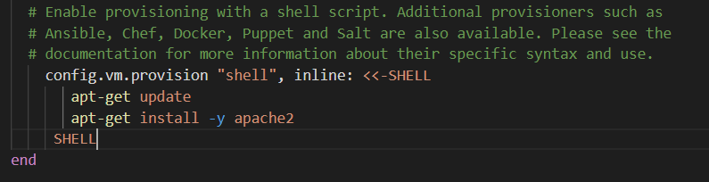

M300 - 20 Infrastruktur-Automatisierung
=======================================

Diese Wikiseite zeigt die theoretischen Inhalte beim Einrichten einer Dynamischen Infrastruktur-Plattform (Private Cloud) auf Basis von konsistenten und wiederholbaren Definitionen.

#### Lernziele

Sie können eine Dynamischen Infrastruktur-Plattform (Private Cloud) einrichten, auf der Virtuelle Maschinen auf Basis von konsistenten und wiederholten Definitionen automatisiert erstellt werden können.

#### Voraussetzungen

* [10 Toolumgebung](../10-Toolumgebung/)

#### Inhaltsverzeichnis

* 01 - [Vagrant](#-03---vagrant)
* 02 - [Packer (optional)](#-04---packer)
* 03 - [AWS Cloud (optional)](#-05---aws-cloud)
* 04 - [Reflexion](#-06---reflexion)
* 05 - [Fragen](Fragen.md)
* 06 - [Quellenverzeichnis](#-08---quellenverzeichnis)
* 07 - [Beispiele (für LB2)](#-09---beispiele-für-lb2)
* 08 - [LB 2 hands-on](LB2.md)
* 09 - [Mögliche Serverdienste für die Automatisierung](https://wiki.ubuntuusers.de/Serverdienste/)

___

 03 - Vagrant
======

> [⇧ **Nach oben**](#inhaltsverzeichnis)

[](https://www.youtube.com/watch?v=X82DXsAeVDQ)

Vagrant Tutorial Deutsch

---

Vagrant ist eine Ruby-Anwendung (open-source) zum Erstellen und Verwalten von virtuellen Maschinen (VMs).

Die Ruby-Anwendung dient als Wrapper (engl. Verpackung, Umschlag) zwischen Virtualisierungssoftware wie VirtualBox, VMware und Hyper-V und Software-Konfiguration-Management-Anwendungen bzw. Systemkonfigurationswerkzeugen wie Chef, Saltstack und Puppet.

**Wichtig:** Die Virtuellen Maschinen entsprechen lauffähigen Servern.


### Funktionsweise & Konzepte
***

**CLI** <br>
Vagrant wird über die Kommandozeile (CLI) bedient.

Die wichtigsten Befehle sind:

| Befehl                    | Beschreibung                                                      |
| ------------------------- | ----------------------------------------------------------------- | 
| `vagrant init`            | Initialisiert im aktuellen Verzeichnis eine Vagrant-Umgebung und erstellt, falls nicht vorhanden, ein Vagrantfile |
| `vagrant up`              |  Erzeugt und Konfiguriert eine neue Virtuelle Maschine, basierend auf dem Vagrantfile |
| `vagrant ssh`             | Baut eine SSH-Verbindung zur gewünschten VM auf                   |
| `vagrant status`          | Zeigt den aktuellen Status der VM an                              |
| `vagrant port`            | Zeigt die Weitergeleiteten Ports der VM an                        |
| `vagrant halt`            | Stoppt die laufende Virtuelle Maschine                            |
| `vagrant destroy`         | Stoppt die Virtuelle Maschine und zerstört sie.                   |

Weitere Befehle unter: https://www.vagrantup.com/docs/cli/

**Boxen** <br>
Boxen sind bei Vagrant vorkonfigurierte VMs (Vorlagen). Diese sollen den Prozess der Softwareverteilung und der Entwicklung beschleunigen. Jede Box, die von dem Nutzer benutzt wurde, wird auf dem Computer gespeichert und muss so nicht wieder aus dem Internet geladen werden.

Boxen können explizit durch den Befehl `vagrant box add [box-name]` oder `vagrant box add [box-url]` heruntergeladen und durch `vagrant box remove [box-name]` entfernt werden. Ein "box-name" ist dabei durch Konvention wie folgt aufgebaut: *Entwickler/Box* (z.B. ubuntu/xenial64).

Die [Vagrant Boxen-Plattform](https://app.vagrantup.com/boxes/search) dient dabei als Austauschstelle für die Suche nach Boxen und das Publizieren von eigenen Boxen. 

**Konfiguration** <br>
Die gesamte Konfiguration erfolgt im Vagrantfile, das im entsprechenden Verzeichnis liegt. Die Syntax ist dabei an die Programmiersprache Ruby) angelehnt:
```Ruby
    Vagrant.configure("2") do |config|
        config.vm.define :apache do |web|
            web.vm.box = "bento/ubuntu-16.04"
            web.vm.provision :shell, path: "config_web.sh"
            web.vm.hostname = "srv-web"
            web.vm.network :forwarded_port, guest: 80, host: 4567
            web.vm.network "public_network", bridge: "en0: WLAN (AirPort)"
    end
```

**Provisioning** <br>
Provisioning bedeutet bei Vagrant, Anweisung an ein anderes Programm zu geben. In den meisten Fällen an eine Shell, wie Bash. Die nachfolgenden Zeilen installieren den Web Server Apache.
```Ruby
    config.vm.provision :shell, inline: <<-SHELL 
        sudo apt-get update
        sudo apt-get -y install apache2
     SHELL
```

**Provider** <br>
Die Angabe des Providers im Vagrantfile definiert, welche Dynamic Infrastructure Platform zum Einsatz kommt (z.B. VirtualBox).
```Ruby
    config.vm.provider "virtualbox" do |vb|
        vb.memory = "512"  
    end
```


### Workflow
***

**Box hinzufügen** <br>
Hinzufügen einer Box zur lokalen Registry:
```Shell
      vagrant box add [box-name]
```


In der lokalen Registry vorhandene Boxen anzeigen:
```Shell
      vagrant box list
```


**VM erstellen** <br>
Vagrantfile Erzeugen und Provisionierung starten:
```Shell
      mkdir myserver
      cd myserver
      vagrant init ubuntu/xenial64
      vagrant up
```


Aktueller Status der VM anzeigen:
```Shell
      vagrant status
```


**VM updaten** <br>
Nach Änderungen im Vagrantfile kann ein Server wie folgt aktualisiert werden:


```Shell
      vagrant provision
```
oder
```Shell
      vagrant destroy -f
      vagrant up
```


**VM löschen** <br>
Die VM kann wie folgt gelöscht werden:
```Shell
      7vagrant destroy -f
```

### Synced Folders (Gemeinsame Ordner)
***
Synchronisierte Ordner ermöglichen es der VM auf Verzeichnisse des Host-Systems zuzugreifen.

Z.B. das HTML-Verzeichnis des Apache-Webservers mit dem Host-Verzeichnis synchronisieren (wo das Vagrantfile liegt):
```Ruby
    Vagrant.configure(2) do |config|
        config.vm.synced_folder ".", "/var/www/html"  
    end
```

**Wichtig:** Standardmässig wird das aktuelle Vagrantfile-Verzeichnis in der VM unter /vagrant gemountet.

### Mehrere VMs in einem VagrantFile
***
Man kann auch mehrere VMs in einem VagrantFile erstellen. 

Solch ein File könnte dann wie folgt aussehen:
```Shell
Vagrant.configure("2") do |config|
  config.vm.box = "ubuntu/xenial64"

  config.vm.define "client1" do |client1|
    vm1.vm.network "private_network", ip: "10.0.120.10"

  end

  config.vm.define "client2" do |client2|
    vm2.vm.network "private_network", ip: "10.0.120.20"
  end
end
```

 04 - Packer
======

> [⇧ **Nach oben**](#inhaltsverzeichnis)

Packer ist ein Tool zur Erstellung von Images bzw. Boxen für eine Vielzahl von Dynamic Infrastructure Platforms mittels einer Konfigurationsdatei.

**Wichtig:** Images bzw. Boxen sind Vorlagen aus denen Virtuelle Maschinen (VMs) entstehen.

### Funktionsweise
***

Packer wird über die Kommandozeile (CLI) bedient.

Der wichtigste Befehle ist `packer build` um ein Image zu erstellen.

Die Konfiguration erfolgt im JSON Format. Hier ein Beispiel:
```JSON
    {
      "provisioners": [
        {
          "type": "shell",
          "execute_command": "echo 'vagrant'|sudo -S sh '{{.Path}}'",
          "override": {
            "virtualbox-iso": {
              "scripts": [
                "scripts/server/base.sh",
              ]
            }
          }
        }
      ],
      "builders": [
        {
          "type": "virtualbox-iso",
      "boot_command": [
        " preseed/url=http://{{ .HTTPIP }}:{{ .HTTPPort }}/ubuntu-preseed.cfg<wait>",
      ],
        }
      ],
      "post-processors": [
        {
          "type": "vagrant",
          "override": {
            "virtualbox": {
              "output": "ubuntu-server-amd64-virtualbox.box"
            }
          }
        }
      ]      
    }
```

**Provisioning** <br>
Auch bei Packer steht Provisioning für Anweisungen an ein anderes Programm (z.B. eine Shell wie Bash).

**Builder** <br>
Die Builder erstellen ein Image für eine bestimmte dynamische Infrastruktur-Plattform (wie z.B. VirtualBox).

**Post-processors** <br>
Sind Bestandteile von Packer, die das Ergebnis eines Builders oder eines anderen Post-Prozessor übernehmen, um damit ein neues Artefakt zu erstellen. 


### Installation
***
1. Packer herunterladen von: https://www.packer.io/
    * Auf Button `DOWNLOAD ...` klicken
    * Windows 64 oder macOS 64-Bit anwählen
    * Warten, bis Datei heruntergeladen wurde
2. Heruntergeladene Datei `packer_....zip` entpacken
3. Terminal (*Bash*) öffnen & Ordner erstellen:
```Shell
    $ sudo mkdir ~/packer
    $ cd ~/packer 

    $ pwd                               #Gibt den Pfad des Ordners aus
    
    /Users[Dein-Benutzername]/packer
```


4. Entpackte Datei `packer` in das erstelltes Verzeichnis kopieren
```Shell
    $ cp packer ~/packer
```


5. Pfad in der Path-Variable hinterlegen (damit das System das Command kennt):
```Shell
    $ export PATH="$PATH:/Users[Dein-Benutzername]/packer"
```


> #### Änderung und anzeigen der Umgebungsvariablen
>
> Umgebungsvariablen können folgendermassen gesetzt und den anderen Prozessen innerhalb des Betriebssystems bekannt gemacht werden:
>
> Setzen der Variable: <Variablenname>=<Variableninhalt>
> Bekanntmachen der Variable: export <Variablenname>
> Löschen der Variable: unset <Variablenname>
> Abfrage der Variable: env
>
> Weitere Informationen zu Umgebungsvariablen:   
> https://de.wikipedia.org/wiki/Umgebungsvariable#%C3%84nderung_der_Umgebungsvariablen
>

6. Funktion von Packer testen:
```Shell
    $ packer

    Usage: packer [--version] [--help] <command> [<args>]

    Available commands are:
        build       build image(s) from template
        fix         fixes templates from old versions of packer
        inspect     see components of a template
        validate    check that a template is valid
        version     Prints the Packer version
```


 05 - AWS Cloud
======
Bei der Installation von AWS Cloud hatte ich, wie andere auch Probleme. Das AWS Plugin scheint auf der aktuellen Windows Version nicht wirklich zu funktionieren. Laut Dokumentationen war eine ältere Version des Plugins mal mit Windows kompatibel, ist es jetzt aber nicht mehr.

 06 - Netzplan
======


 07 - Reflexion
======

> [⇧ **Nach oben**](#inhaltsverzeichnis)

Unter **[Cloud Computing](https://de.wikipedia.org/wiki/Cloud_Computing)** (deutsch Rechnerwolke) versteht man die Ausführung von Programmen, die nicht auf dem lokalen Rechner installiert sind, sondern auf einem anderen Rechner, der aus der Ferne aufgerufen wird (bspw. über das Internet).

Eine **dynamische Infrastruktur-Plattform** ist ein System, das Rechen-Ressourcen bereitstellt (Virtualisiert),
insbesondere Server (compute), Speicher (storage) und Netzwerke (networks), und diese
Programmgesteuert zuweist und verwaltet, sogenannte **Virtuelle Maschinen** (VM).

Damit "Infrastructure as Code" auf "Dynamic Infrastructure Platforms" genutzt werden können, müssen sie die folgenden Anforderungen erfüllen:

- **Programmierbar** - Ein Userinterface ist zwar angenehm und viele Cloud Anbieter haben eines, aber für "Infrastructure as Code"
muss die Plattform via Programmierschnittstelle ([API](https://de.wikipedia.org/wiki/Programmierschnittstelle)) ansprechbar sein.
- **On-demand** - Ressourcen (Server, Speicher, Netzwerke) schnell erstellen und vernichtet.
- **Self-Service** - Ressourcen anpassen und auf eigene Bedürfnisse zuschneiden.
- **Portabel** - Anbieter von Ressourcen müssen austauschbar sein.
- Sicherheit, Zertifizierungen (z.B. [ISO 27001](https://de.wikipedia.org/wiki/ISO/IEC_27001)), ...


 08 - Quellenverzeichnis
====== 

> [⇧ **Nach oben**](#inhaltsverzeichnis)

 09 - Beispiele (für LB2)
======

> [⇧ **Nach oben**](#inhaltsverzeichnis)

1.  Terminal (*Bash*) öffnen
2.  In das entsprechende Verzeichnis z.B. `cd M300/vagrant/web` wechseln. `README.md` studieren, z.B. mittels `less README.md`.

* [web - Einfacher Webserver](../vagrant/web/)
* [db - MySQL mit UserInterface](../vagrant/db/)
* [script - Shellscript erstellt mehrere Web Server VM's](../vagrant/script/)
* [mmdb - Multi Machine, Erstellung von mehreren VM's mittels Vagrantfile](../vagrant/mmdb/)
* [lam - Linux, Apache, MySQL, REST Umgebung](../vagrant/lam/)
* [iot - Umfangreicheres Beispiel mit Desktop Umgebung](../vagrant/iot/)
* [cloud-init - Vagrant mit Cloud-init](../vagrant/cloud-init/)
* [MAAS Umgebung in einer VM](../vagrant/maas/)

